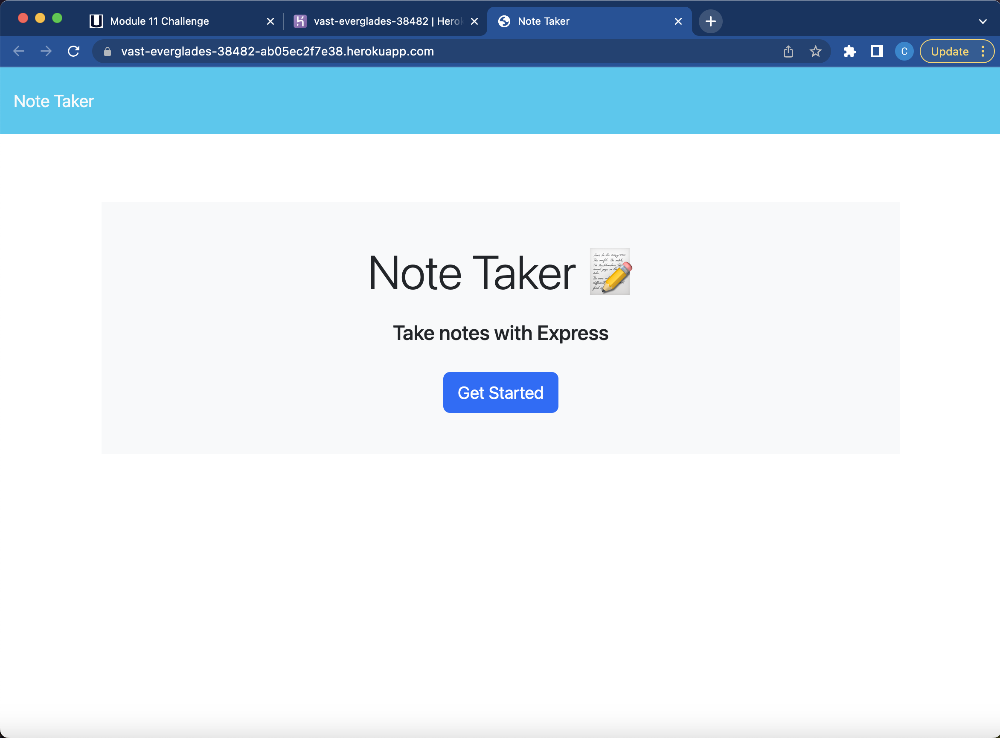
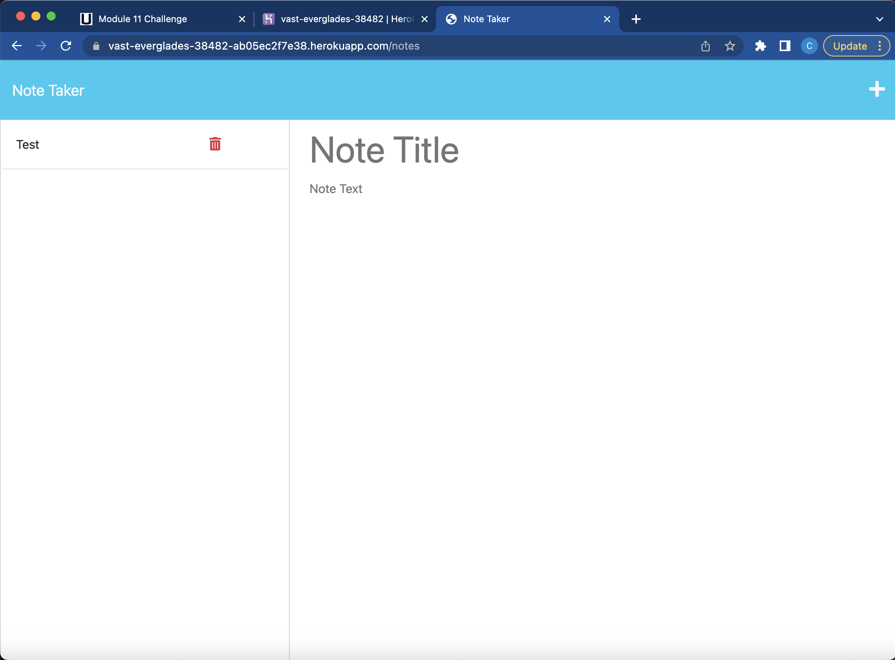

# Note Taker Application  

  ## Description
  This project was created for a user to easily keep track of important reminders by writing and storing them as notes. The front end of this application is built on HTML, CSS, and JavaScript and sends HTTP requests to the backend API endpoints in order to function. The back end is built on node.js and the express.js framework to handle requests. The application uses the fs module to save user input and the uuid npm package for unique ids.
  
  ## Usage Information
  A user should hit the get started button on the landing page when opening the site. The + symbol in the top right corner creates a new note which accepts a title with a short description in the input fields. Once created, the note can be saved and will persist in the left hand column until deleted. After saving the note, the user can click on its title in the left hand column to view the description of the note.

  ## Contribution Guidelines
  The application's front end offers a delete button to the right of each note. Further development on the back end is needed to provide this functionality by adding a delete route.

  ## Link to Webpage
  [Click Here](https://vast-everglades-38482-ab05ec2f7e38.herokuapp.com/)

  ## Screenshots of Webpage
  
  